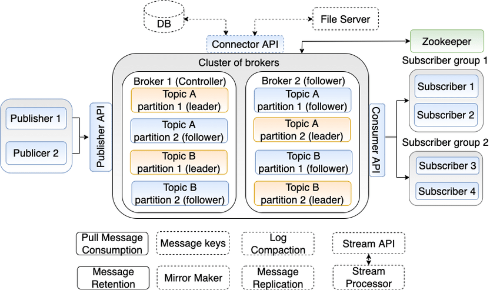

# Projeto Sistemas Distribuídos 2023.2

## Ideia geral

O Kafka é uma poderosa ferramenta de Publish/Subscribe, na qual é possível processar uma quantidade massiva de dados
com alta performance e de forma assíncrona, baseada em tópicos.

Ou seja, um sistema que deseje notificar algo para outros sistemas, pode utilizar o Kafka para postar uma mensagem em um
tópico, e todos os listeners (ou subscribers) desse tópico são notificados com essa mensagem. Cada tópico pode conter uma
ou mais particões. A ideia do particionamento é de dividir os dados entre os Brokers de um cluster do Kafka, proporcionando
assim maiores garantias a fim de se evitar a perda de um evento, além de permitir um processamento em paralelo por parte de um
grupo de consumidores.

Na imagem abaixo ilustra como é a arquitetura do Kafka:

O Broker 1 é o leader das particões 1 dos tópicos A e B, e follower nas particões 2 desses mesmos tópicos.
Já o Broker 2 é o leader das particões 2 dos tópicos A e B, e follower nas particões 1 desses mesmos tópicos.

E por quê essa questão de leader/follower é importante ?

Porquê essa definicão pode impactar as garantias de entrega dos eventos, dependendo da forma como os produtores estejam
configurados.

- Se o produtor é configurado com ack=all, ele aguarda a confirmacão de recebimento da mensagem tanto do leader quanto do follower, proporcionando uma pior performance, porém com garantia total da entrega da mensagem;
- Se o produtor é configurado com ack=1, ele aguarda apenas a confirmacão de recebimento da mensagem por parte do leader, proporcionando uma performance intermediária;
- Se o produtor é configurado com ack=0, ele não aguarda nenhuma confirmacão. Logo, não há garantias de entrega, porém temos uma melhor performance

A proposta deste projeto é de validar em uma aplicacão de teste, a diferenca de performance conforme a definicão de ack para
um produtor.

### Build e start da aplicacão
Este projeto tem como propósito demonstrar a variacão de performance conforme a 
definicao de garantias de entrega, utilizando o Kafka como ferramenta de Publish-Subscribe.

Para executar o projeto, você deve ter configurado em sua máquina o docker e o docker compose.

Siga os seguintes passos para subir a aplicacão:

- Gere uma imagem docker da aplicacão Java utilizando o comando abaixo:

`
docker build -t projeto-sd:latest .
`
- Com a imagem da aplicacão gerada, basta executar o docker compose para subir todos os containers necessários:

`
docker compose up -d
`

Ao executar este comando, é esperado que você tenha em execucão:
- 3 containers de projeto-sd
  - A instância **projeto-sd-1** está configurada com **ack=all** (Vide docker-compose.yaml)
  - A instância **projeto-sd-2** está configurada com **ack=1** (Vide docker-compose.yaml)
  - A instância **projeto-sd-3** está configurada com **ack=0** (Vide docker-compose.yaml)
- 3 containers de kafka-broker 
- 1 container do zookeeper 
- 1 container do grafana
- 1 container do prometheus

para gerar a massa de dados, execute o script `test.sh` para todas as instancias da aplicacao:

`
bash ./test.sh 8080
`

`
bash ./test.sh 8081
`

`
bash ./test.sh 8082
`

Para visualizar os dados, acesse o grafana em `http://localhost:3000`

Configure o Prometheus como datasource do Grafana em `http://localhost:3000/connections/add-new-connection`.
A url do Prometheus será `http://prometheus:9090`.

Os dashboards podem ser criados importando o arquivo [dashboard.json](dashboard.json) na raiz desse projeto.
